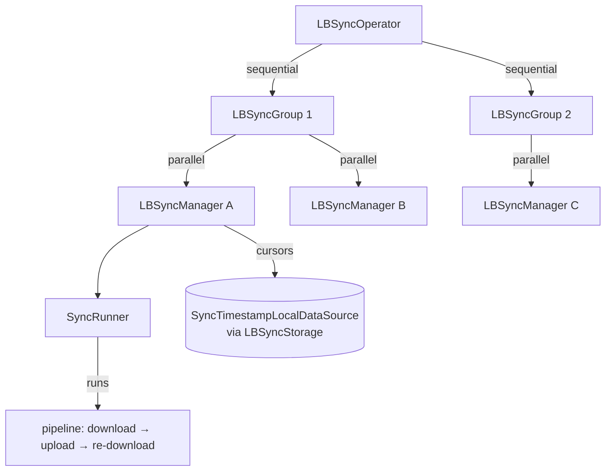
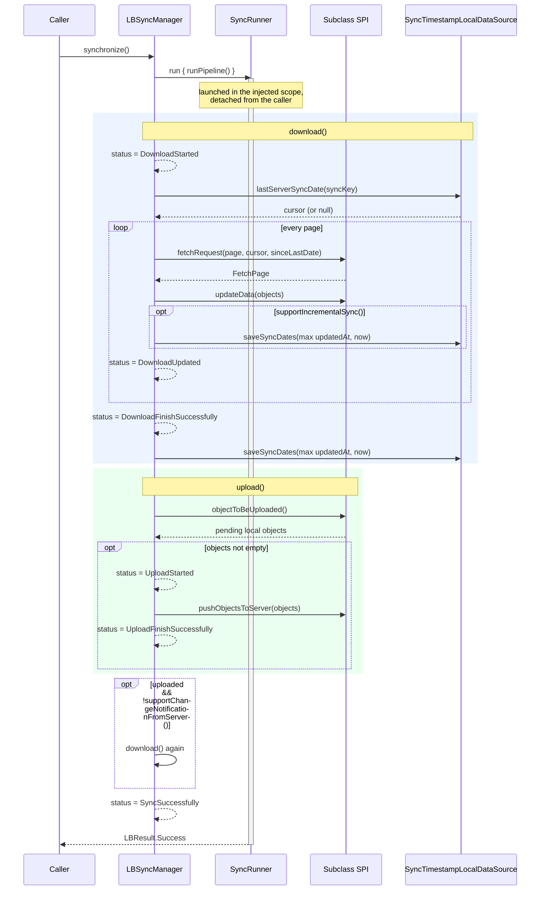
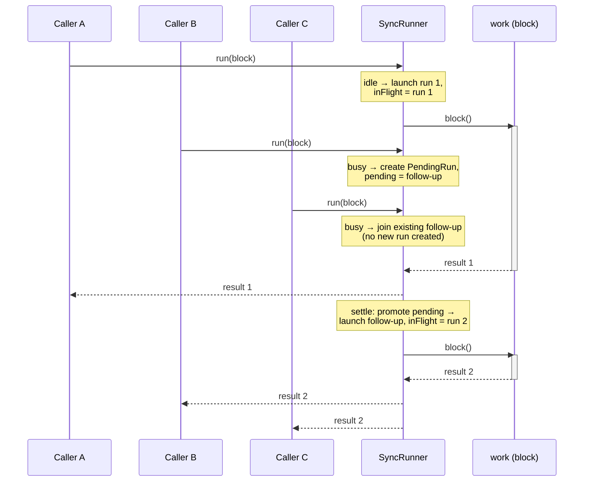
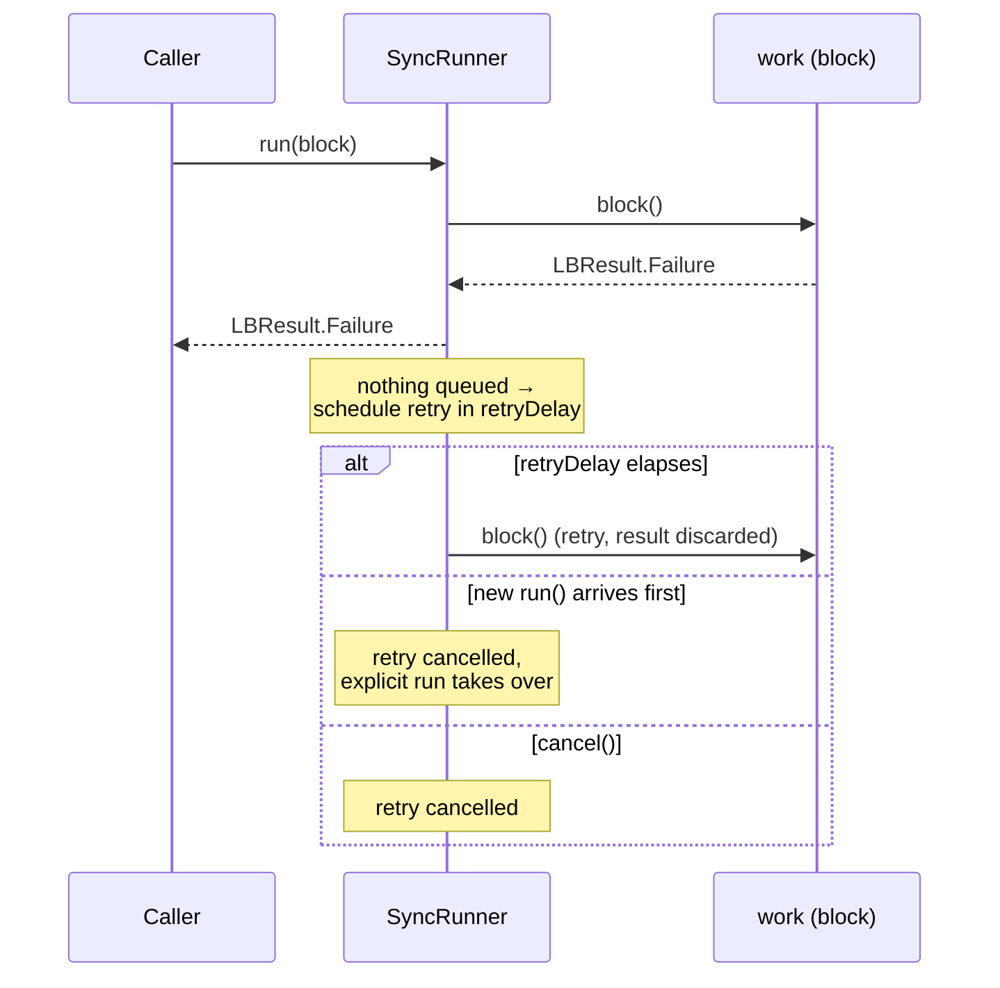
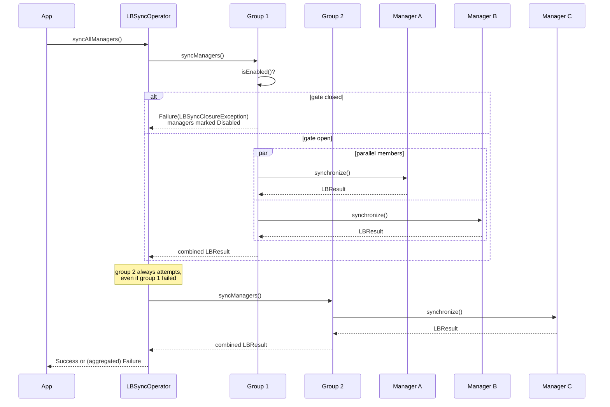
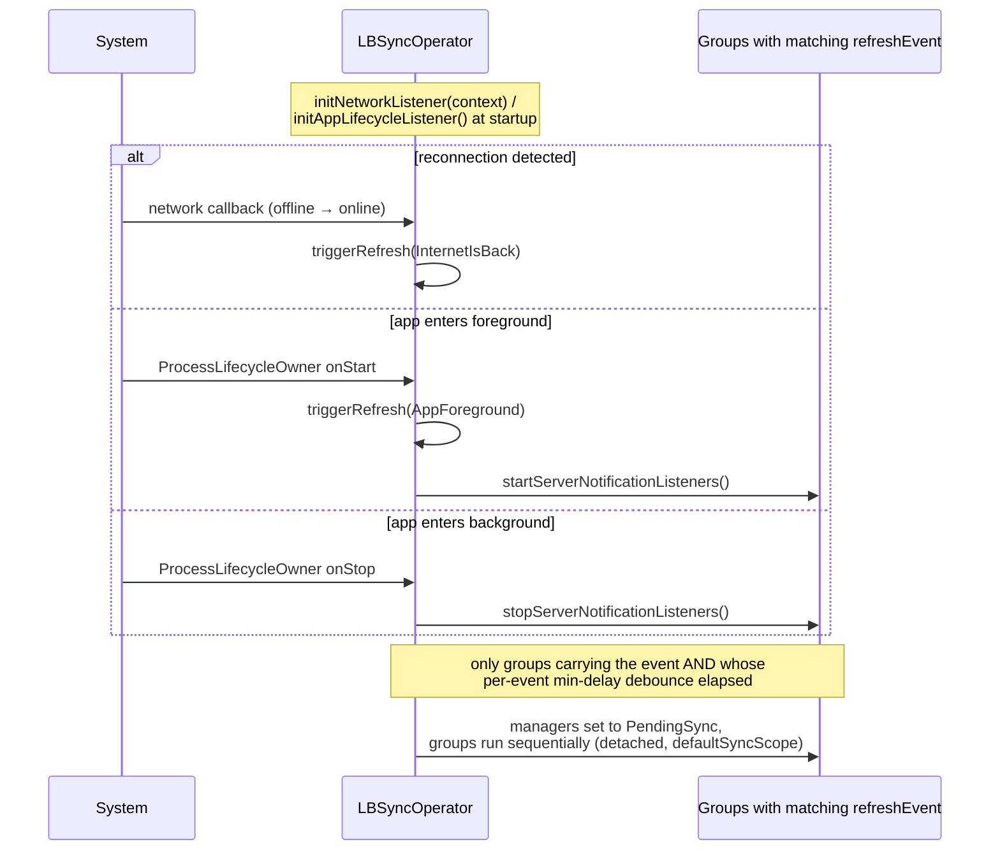

# synchronization-core

Coroutine-native, storage-agnostic synchronization engine. Publishes as
`studio.lunabee.synchronization:synchronization-core`.

Three layers, top to bottom:

- **`LBSyncOperator`** — app-wide singleton registry of groups. Runs groups **sequentially**, listens to
  network / app-lifecycle events to trigger refreshes.
- **`LBSyncGroup`** — a set of managers synchronized **in parallel**. Model table dependencies by putting
  the dependency in an earlier group. A suspend `isEnabled` gate can disable a whole group.
- **`LBSyncManager<ServerData, LocalData, PageInfo>`** — abstract per-entity engine running the
  download → upload → re-download pipeline. Subclasses implement the fetch/push SPI.

Run scheduling (single-flight, collapse-and-join, automatic retry) is delegated to the pure
`commonMain` deep module **`SyncRunner`**. Sync cursors are persisted through the
`SyncTimestampLocalDataSource` interface, resolved process-wide via `LBSyncStorage.install(...)`
(see the backend modules `synchronization-core-datastore` / `synchronization-core-room`).



## `LBSyncManager` pipeline

One `suspend` entry point: `synchronize(): LBResult<Unit>`. The pipeline downloads every page, uploads
pending local objects, then re-downloads (unless the server pushes change notifications). Status is
exposed as `status: StateFlow<LBSyncProcessStatus>`; only the engine mutates it.



A thrown error in `fetchRequest` / `pushObjectsToServer` maps to `DownloadFinishWithError` /
`UploadFinishWithError` and the run returns `LBResult.Failure` (the `SyncRunner` then schedules the
automatic retry).

## `SyncRunner` — single-flight collapse-and-join

At most one run is in flight. Callers arriving while a run is in flight collapse into **exactly one**
follow-up run and all receive that follow-up's real result. The follow-up is stored un-launched
(`PendingRun`) and only launched when the in-flight run settles.



### Failure retry

A failed run with no queued follow-up schedules a re-run after `retryDelay` (default 30 s, `null`
disables). The retry's result is discarded — awaiting callers already received the failure. A new
explicit `run()` or a `cancel()` pre-empts a pending retry.



`cancel()` also cancels the in-flight run and resolves every awaiter — including collapsed callers
whose follow-up never launched — with an `LBResult.Failure` carrying the cancellation cause; the
runner stays reusable afterwards.

## Global flow — operator and groups

`LBSyncOperator.syncAllManagers()` runs groups sequentially in registration order; each group runs its
managers in parallel (`async`/`awaitAll` — a failing sibling never cancels the others). Failures
aggregate: one failure surfaces as-is, several wrap into `LBSyncAggregateException`.



### Event-triggered refresh



## Observation

- `LBSyncManager.status: StateFlow<LBSyncProcessStatus>` — collect it; `currentSyncStatus` is a
  read-only alias of `status.value`.
- `LBSyncGroup.statusByKey()` / `LBSyncOperator.statusByKey()` — combined
  `Flow<Map<SyncKey, LBSyncProcessStatus>>`, snapshot of the registry at collection time.
- `isSyncing(): Flow<Boolean>` — `true` while any member status `isProcessing()`. Mind the quirk:
  the mid-pipeline `UploadFinishSuccessfully` / `DownloadFinishSuccessfully` steps count as processing;
  only `Sync*` / `NeverSync` / `Disabled` / `*WithError` are terminal.

## Setup

```kotlin
// 1. Install a cursor-storage backend once at startup (pick one backend module):
LBSyncStorage.install(context.dataStoreSyncTimestampLocalDataSource()) // or roomSyncTimestampLocalDataSource()

// 2. Register groups and init listeners:
LBSyncOperator.groups["main"] = LBSyncGroup(syncManagers = linkedSetOf(myManager))
LBSyncOperator.initNetworkListener(context)
LBSyncOperator.initAppLifecycleListener()

// 3. Seed statuses from persisted cursors (otherwise NeverSync until first sync):
LBSyncOperator.loadAllStatuses()
```

Renaming a manager subclass silently resets its cursor unless `syncKey` is overridden — treat
`syncKey` as a persisted key.
